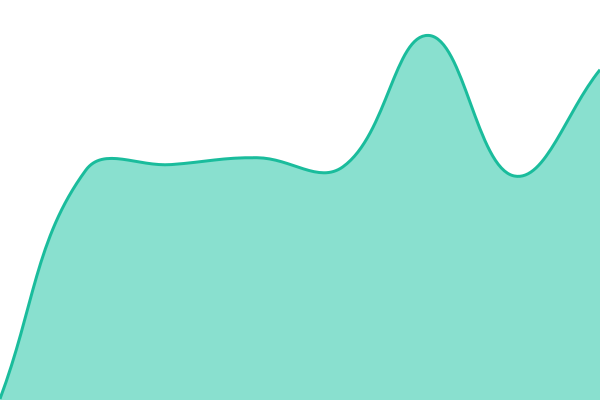
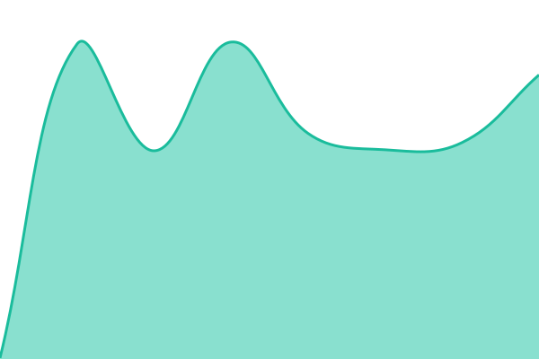
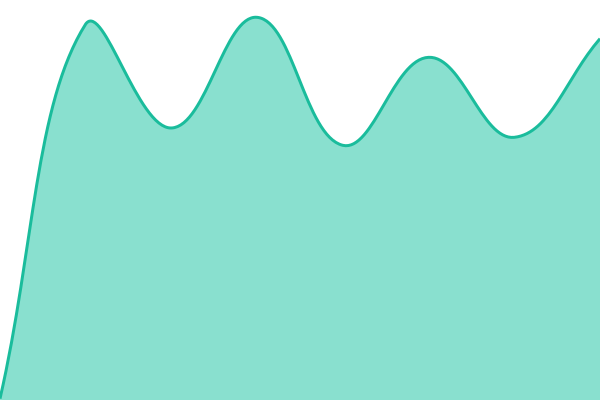

# [📈 Live Status](https://erkansezgin.github.io/agentmemory-status): <!--live status--> **🟧 Partial outage**

This repository contains the open-source uptime monitor and status page for [erkansezgin](https://erkansezgin.github.io/agentmemory-status), powered by [Upptime](https://github.com/upptime/upptime).

With [Upptime](https://upptime.js.org), you can get your own unlimited and free uptime monitor and status page, powered entirely by a GitHub repository. We use [Issues](https://github.com/erkansezgin/agentmemory-status/issues) as incident reports, [Actions](https://github.com/erkansezgin/agentmemory-status/actions) as uptime monitors, and [Pages](https://erkansezgin.github.io/agentmemory-status) for the status page.

<!--start: status pages-->
<!-- This summary is generated by Upptime (https://github.com/upptime/upptime) -->
<!-- Do not edit this manually, your changes will be overwritten -->
<!-- prettier-ignore -->
| URL | Status | History | Response Time | Uptime |
| --- | ------ | ------- | ------------- | ------ |
|  [API](https://agentmem-poc-cmcpe4h3d5hjdzf4.z03.azurefd.net/health/live) | 🟩 Up | [api.yml](https://github.com/erkansezgin/agentmemory-status/commits/HEAD/history/api.yml) | 

 315ms
     
 | 

<a href="https://erkansezgin.github.io/agentmemory-status/history/api">100.00%</a>
    

|  [API readiness](https://agentmem-poc-cmcpe4h3d5hjdzf4.z03.azurefd.net/health/ready) | 🟩 Up | [api-readiness.yml](https://github.com/erkansezgin/agentmemory-status/commits/HEAD/history/api-readiness.yml) | 

 340ms
     
 | 

<a href="https://erkansezgin.github.io/agentmemory-status/history/api-readiness">100.00%</a>
    

|  [Console](https://agentmem-poc-cmcpe4h3d5hjdzf4.z03.azurefd.net/app/) | 🟩 Up | [console.yml](https://github.com/erkansezgin/agentmemory-status/commits/HEAD/history/console.yml) | 

 304ms
     
 | 

<a href="https://erkansezgin.github.io/agentmemory-status/history/console">100.00%</a>
    

|  [Status & notices (JSON)](https://agentmem-poc-cmcpe4h3d5hjdzf4.z03.azurefd.net/api/status) | 🟥 Down | [status-and-notices-json.yml](https://github.com/erkansezgin/agentmemory-status/commits/HEAD/history/status-and-notices-json.yml) | 

 317ms
     
 | 

<a href="https://erkansezgin.github.io/agentmemory-status/history/status-and-notices-json">66.81%</a>
    

<!--end: status pages-->

[**Visit our status website →**](https://erkansezgin.github.io/agentmemory-status)

## 📄 License

- Powered by: [Upptime](https://github.com/upptime/upptime)
- Code: [MIT](./LICENSE) © [Anand Chowdhary](https://anandchowdhary.com)
- Data in the `./history` directory: [Open Database License](https://opendatacommons.org/licenses/odbl/1-0/)
